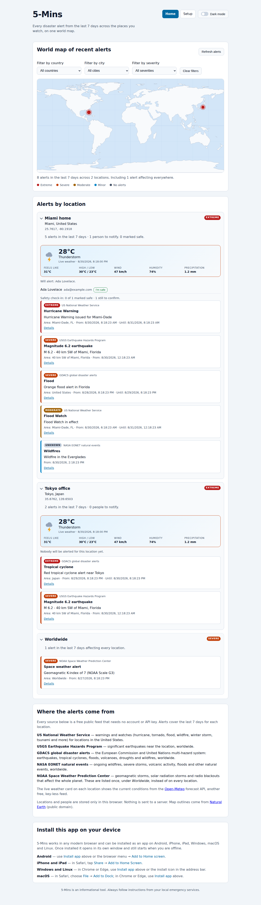
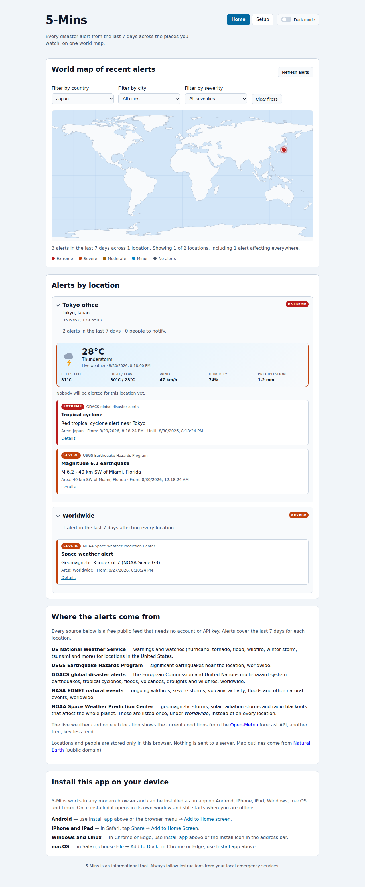
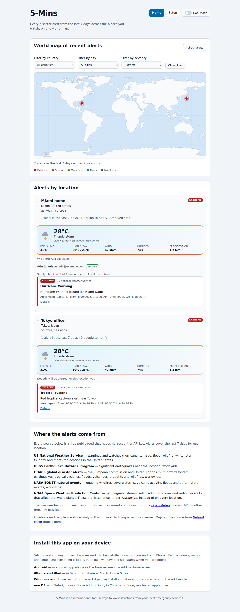
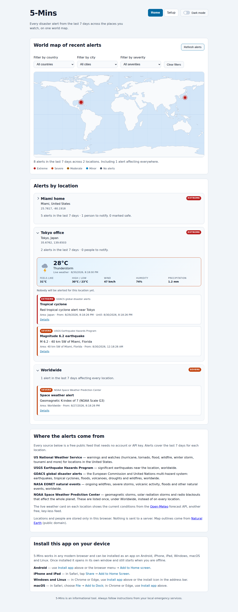
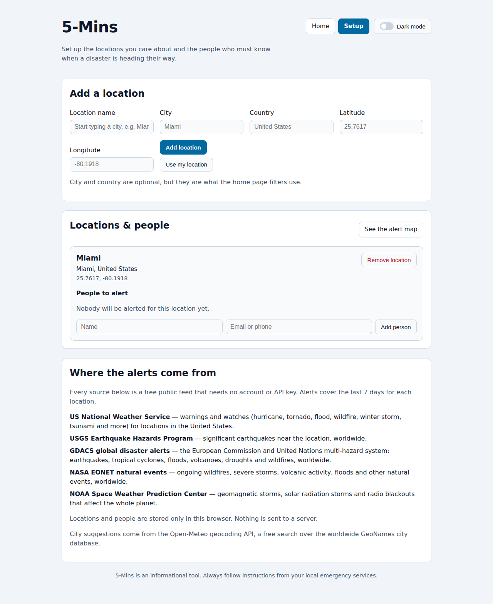
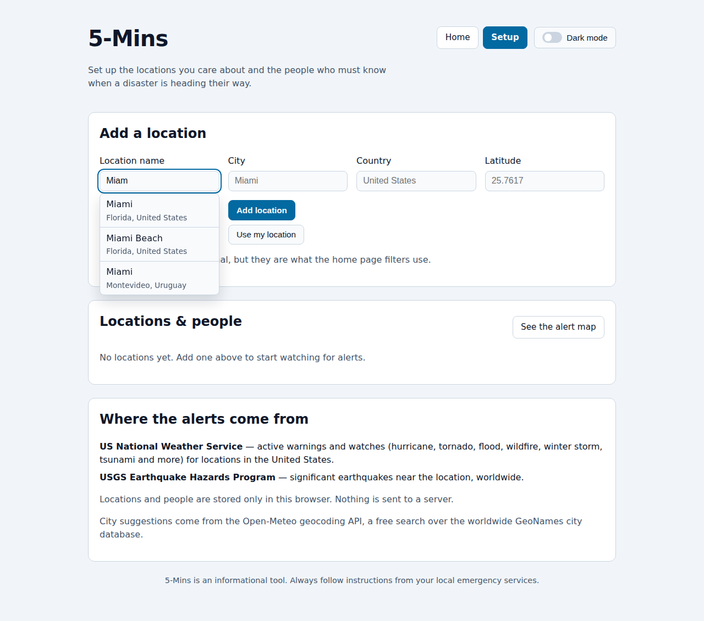
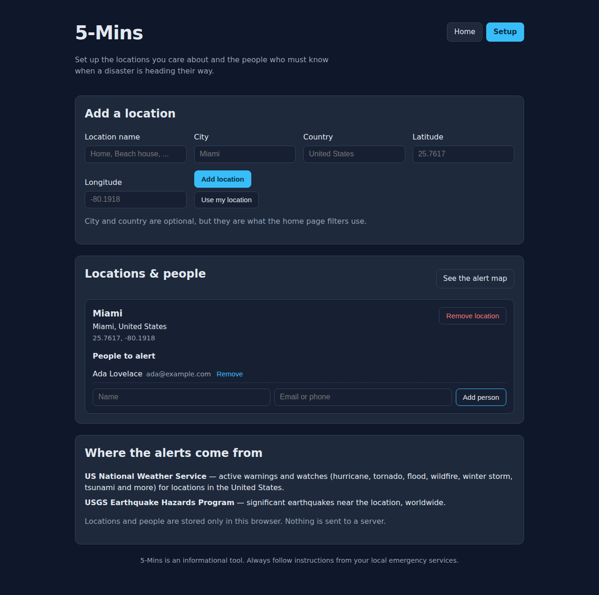
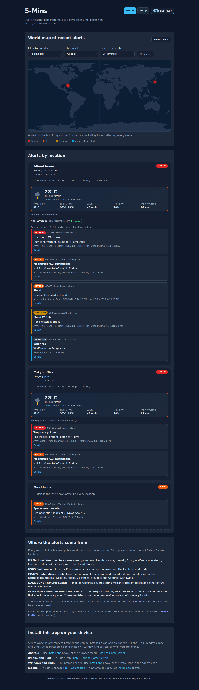
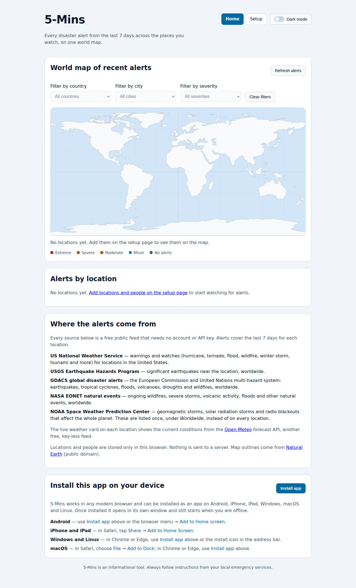

# 5-Mins

Provide users an alert before a catastrophe or disaster. The crucial minutes to save lives. 

5-Mins is a small static website with two pages:

- **Home** — a world map of every disaster or catastrophe alert reported for
  the locations you watch over the last 7 days, with filters by country, city
  and severity.
- **Setup** — where you add the **locations** you care about and the **people**
  who must be warned about each of them.

**Live site:** https://charles2ke.github.io/5-Mins/ (published automatically from
`main`).

## Features

### Home page

- World map with one marker per location, coloured by the most severe alert
  reported there in the last 7 days and sized by how many alerts there are.
- Filter the map and the list by **country**, **city** or **severity**. The city
  filter only offers cities from the selected country, and every filter is kept
  in the URL (`?country=japan&city=tokyo&severity=extreme`) so a filtered view
  can be shared.
- Every location card **folds away** with a click on its header; the alert count
  and the worst severity stay visible while it is folded.
- Click (or focus and press <kbd>Enter</kbd> on) a marker to highlight that
  location in the list below the map.
- A **live weather card** for every location: current temperature, a drawn
  condition icon, what it feels like, today's high and low, wind, humidity and
  precipitation, refreshed with the alerts. Rough weather (thunderstorms, snow,
  sleet or strong wind) is highlighted on the card.
- Every alert reported for every location over the last **7 days**, sorted with
  the most severe first and colour coded by severity (Extreme, Severe, Moderate,
  Minor).
- Alerts that reach the whole planet, such as the NOAA space weather alerts, are
  listed once under a **Worldwide** card instead of on every location, and that
  card carries no local weather.
- Refresh all alerts on demand.
- While an alert is active, each person can mark themselves safe. A new alert
  clears those check-ins so everyone confirms again.

### Setup page

- Add any number of locations: type a city name and pick it from the
  autocomplete, use the browser's "Use my location" button, or enter
  coordinates by hand.
- City suggestions cover every known city worldwide and fill in the latitude,
  longitude, city and country of the city you choose, so the home page filters
  work straight away.
- Add and remove the people who should be alerted for each location, with an
  email address or phone number for each.

### Everywhere

- Dark and light themes: the site follows the system colour scheme, and the
  header toggle pins a theme that is remembered on the next visit.
- Locations and people are stored in the browser's `localStorage`, so they
  survive reloads and never leave your device.
- Runs as an installable Progressive Web App on Android, iOS, iPadOS, Windows,
  macOS and Linux, and can reopen offline.

## Screenshots

These are captured by the Playwright suite, so they always match the current
behaviour of the site.



*Home — every alert from the last 7 days on the world map, with the alert list underneath.*



*Home — filtered to a single country; the city filter narrows to that country's
cities and the filters are kept in the URL.*


*Home — alerts that reach the whole planet are listed once under Worldwide, with
no local weather card.*



*Home — filtered by severity; only alerts of the chosen severity are listed and
locations without one drop off the map.*



*Home — a folded location card keeps its alert count and worst severity in
view.*


*Home — the live weather card shows the current conditions for each location
above its alerts.*



*Setup — add the locations you watch, with an optional city and country that
power the home page filters.*



*Setup — start typing a city and pick it from the suggestions; the coordinates,
city and country are filled in for you.*



*Setup — add the people who must be warned about each location.*

The site follows your system's colour scheme, and the header toggle pins light
or dark for good:

| Light | Dark |
| --- | --- |
|  |  |



## Alert sources

| Source | Coverage |
| --- | --- |
| [US National Weather Service](https://www.weather.gov/documentation/services-web-api) | All warnings, watches and advisories issued for a US point in the last 7 days: hurricanes, tornadoes, floods, wildfires, tsunamis, winter storms, extreme heat and more. Only queried for locations in the United States and its territories; the feed rejects points it cannot map to a US forecast zone. |
| [USGS Earthquake Hazards Program](https://earthquake.usgs.gov/fdsnws/event/1/) | Earthquakes of magnitude 4.5 or greater within 300 km of the location in the last 7 days, worldwide. |
| [GDACS](https://www.gdacs.org/) | The European Commission and United Nations multi-hazard system: earthquakes, tropical cyclones, floods, volcanoes, droughts and wildfires within 1000 km of the location in the last 7 days, worldwide. |
| [NASA EONET](https://eonet.gsfc.nasa.gov/) | Ongoing natural events — wildfires, severe storms, volcanic activity, floods, landslides and more — within 1000 km of the location and updated in the last 7 days, worldwide. |
| [NOAA Space Weather Prediction Center](https://www.swpc.noaa.gov/products/alerts-watches-and-warnings) | Geomagnetic storm, solar radiation storm and radio blackout alerts, watches and warnings from the last 7 days. These affect the whole planet, so they are shown for every location. |

Every feed is public and needs no API key. Each one is queried independently, so
if a feed is unavailable the alerts from the others are still shown along with
an explanation.

The world map outlines come from the
[Natural Earth](https://www.naturalearthdata.com/) 1:110m land vectors, which
are in the public domain. They are embedded as a simplified SVG path in
`assets/js/world-land.js`, so the map needs no map tiles, no API key and no
network access.

## Live weather

Each location card shows the current conditions from the
[Open-Meteo forecast API](https://open-meteo.com/en/docs), a free, key-less feed
that needs no account. The card draws the condition (clear, cloud, fog, rain,
sleet, snow or thunderstorm, day or night) and lists the temperature, what it
feels like, today's high and low, wind, humidity and precipitation. If the
lookup is unavailable the card says so and the alerts are still shown.

## City search

The location name field on the setup page is an autocomplete backed by the
[Open-Meteo geocoding API](https://open-meteo.com/en/docs/geocoding-api), a
free, key-less search over the worldwide GeoNames city database. Choosing a
suggestion fills in the coordinates, city and country of that city. If the
lookup is unavailable the field keeps working as a plain text box, so a
location can always be added by entering coordinates manually.

## Running locally

The site is plain HTML, CSS and JavaScript modules — no build step. Serve the
repository root with any static server:

```bash
npm start          # python3 -m http.server 4173
# then open http://127.0.0.1:4173
```

## Tests

End-to-end tests use [Playwright](https://playwright.dev/) with the alert feeds
stubbed out, so they run offline:

```bash
npm install
npx playwright install --with-deps chromium
npm test
```

The `Tests` workflow runs them on every push and pull request and uploads the
Playwright HTML report (including screenshots) as a build artifact.

## Install it on your device

Open https://charles2ke.github.io/5-Mins/ in a modern browser. Chrome and Edge
offer **Install app**; Safari on iPhone, iPad and macOS offers **Add to Home
Screen** or **Add to Dock** from its Share or File menu.

## Deployment

The `Deploy to GitHub Pages` workflow publishes the site to GitHub Pages on
every push to `main`. Enable it once in **Settings → Pages** by selecting
**GitHub Actions** as the source.

## Disclaimer

5-Mins is an informational tool and does not replace official warning systems.
Always follow the instructions of your local emergency services.
