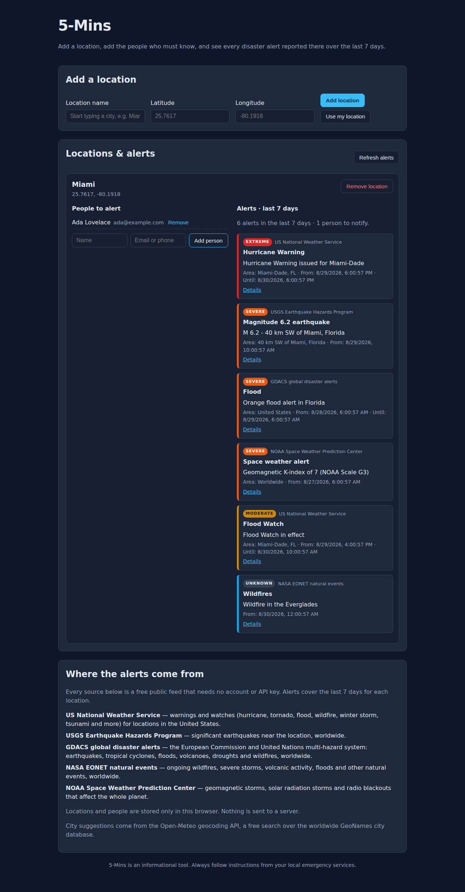

# 5-Mins

Provide users an alert before a catastrophe or disaster. The crucial minutes to save lives. 

5-Mins is a small static website where you add the **locations** you care about
and the **people** who must be warned about each of them. For every location the
site pulls in all the disaster and catastrophe alerts that are currently
available for those coordinates.

**Live site:** https://charles2ke.github.io/5-Mins/ (published automatically from
`main`).

## Screenshots

Start typing a city and pick it from the suggestions — every known city is
searchable and the coordinates are filled in for you:


Each location lists the people to warn next to every alert that is currently
active there, most severe first:



## Features

- Runs on **Android, iPhone, iPad, Windows, macOS and Linux** — it is an
  installable Progressive Web App as well as a website, so it opens in its own
  window and still starts when the device is offline.
- Add any number of locations: type a city name and pick it from the
  autocomplete, use the browser's "Use my location" button, or enter
  coordinates by hand.
- City suggestions cover every known city worldwide and fill in the latitude
  and longitude of the city you choose.
- Add and remove the people who should be alerted for each location, with an
  email address or phone number for each.
- See every active alert for a location, sorted with the most severe first and
  colour coded by severity (Extreme, Severe, Moderate, Minor).
- Refresh all alerts on demand.
- Locations and people are stored in the browser's `localStorage`, so they
  survive reloads and never leave your device.

## Install it on your device

5-Mins is a Progressive Web App, so the same site can be installed as an app on
every major platform. Open https://charles2ke.github.io/5-Mins/ and then:

| Platform | How to install |
| --- | --- |
| Android | Chrome, Edge or Samsung Internet: tap **Install app** in the "Install this app on your device" panel, or the browser menu → **Add to Home screen**. |
| iOS and iPadOS | Safari: tap **Share** → **Add to Home Screen**. |
| Windows | Chrome or Edge: click **Install app**, or the install icon at the right of the address bar. |
| Linux | Chrome, Chromium or Edge: click **Install app**, or the install icon in the address bar. |
| macOS | Safari 17 or later: **File → Add to Dock**. Chrome or Edge: click **Install app**. |

The installed app runs full screen with its own icon, keeps working while
offline (the last version of the app is cached on the device) and stores
locations and people on that device only. Alerts themselves are always fetched
live, so a stale warning is never shown. Browsers that cannot install web apps
still open 5-Mins as an ordinary website — Firefox for Android, for example,
adds it to the home screen from its own menu, and Firefox on the desktop keeps
it as a normal tab.

## Alert sources

| Source | Coverage |
| --- | --- |
| [US National Weather Service](https://www.weather.gov/documentation/services-web-api) | All active warnings, watches and advisories for a US point: hurricanes, tornadoes, floods, wildfires, tsunamis, winter storms, extreme heat and more. |
| [USGS Earthquake Hazards Program](https://earthquake.usgs.gov/fdsnws/event/1/) | Earthquakes of magnitude 4.5 or greater within 300 km of the location in the last 24 hours, worldwide. |

Both feeds are public and need no API key. If one feed is unavailable, the
alerts from the other are still shown along with an explanation.

## City search

The location name field is an autocomplete backed by the
[Open-Meteo geocoding API](https://open-meteo.com/en/docs/geocoding-api), a
free, key-less search over the worldwide GeoNames city database. Choosing a
suggestion fills in the coordinates of that city. If the lookup is unavailable
the field keeps working as a plain text box, so a location can always be added
by entering coordinates manually.

## Running locally

The site is plain HTML, CSS and JavaScript modules — no build step. Serve the
repository root with any static server:

```bash
npm start          # python3 -m http.server 4173
# then open http://127.0.0.1:4173
```

The service worker (`sw.js`) and the web app manifest
(`manifest.webmanifest`) live in the repository root, so serving that directory
is enough to install the app locally too.

## Tests

End-to-end tests use [Playwright](https://playwright.dev/) with the alert feeds
stubbed out, so they run offline:

```bash
npm install
npx playwright install --with-deps chromium
npm test
```

The `Tests` workflow runs them on every push and pull request and uploads the
Playwright HTML report (including screenshots) as a build artifact.

## Deployment

The `Deploy to GitHub Pages` workflow publishes the site to GitHub Pages on
every push to `main`. Enable it once in **Settings → Pages** by selecting
**GitHub Actions** as the source.

## Disclaimer

5-Mins is an informational tool and does not replace official warning systems.
Always follow the instructions of your local emergency services.
